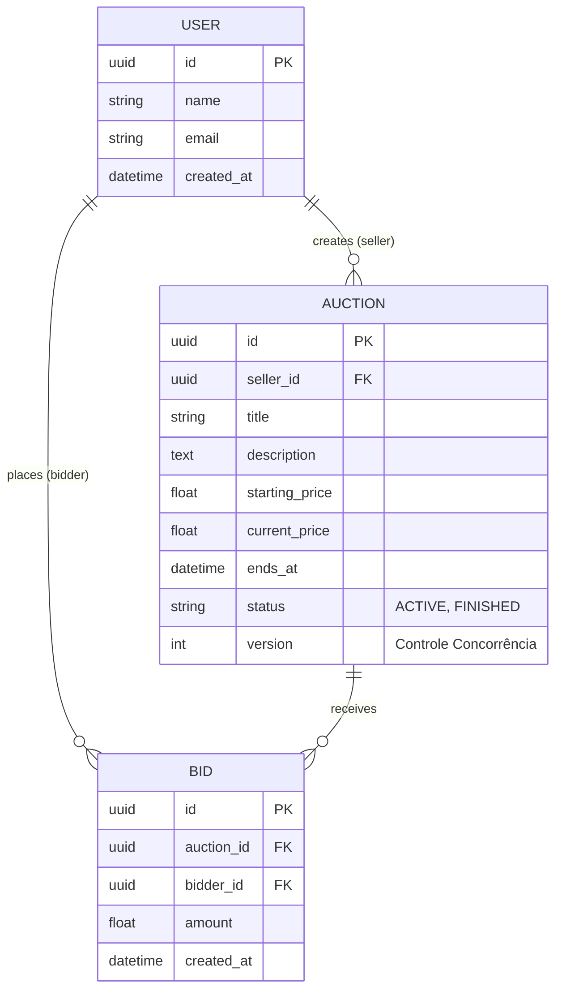

# Modelagem do Banco de Dados (ERD)

### Estratégia de Concorrência (Locking)
Para o sistema de leilão, usamos **Optimistic Locking** através da coluna `version` na tabela `AUCTION`. Sempre que um lance for recebido, o sistema verifica se a versão do leilão em memória bate com a versão do banco. Se não bater, o banco rejeita a transação (alguém deu lance no mesmo milissegundo).

