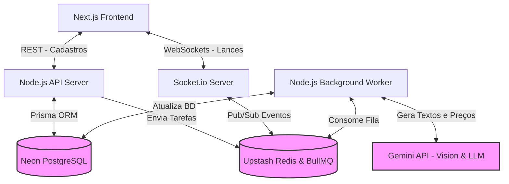

# Arquitetura do Sistema: BidStream

Este diagrama detalha o fluxo de dados e os componentes do sistema.

### Explicação do Fluxo de IA (Background Worker)
Para garantir que o WebSocket nunca fique travado, as chamadas para a API do **Gemini** são enfileiradas no Redis (BullMQ). O Node.js Worker consome essa fila em background, faz a requisição à IA, salva no PostgreSQL (Neon) e dispara um evento via Redis para o Socket.io notificar os clientes na tela.

